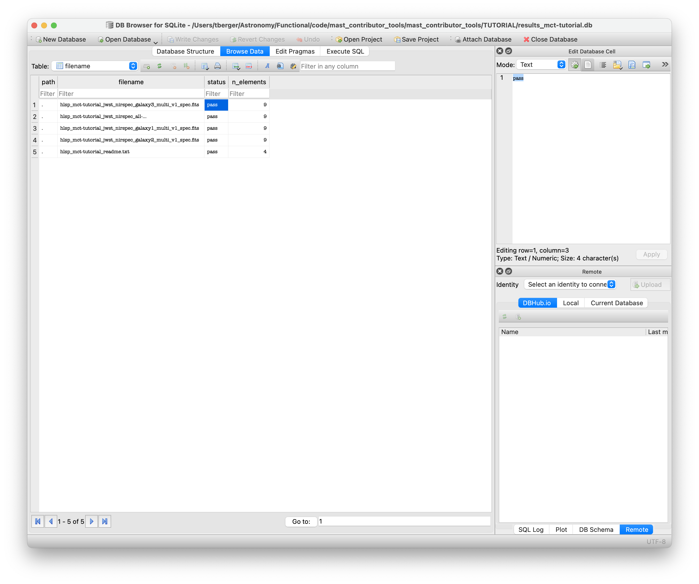
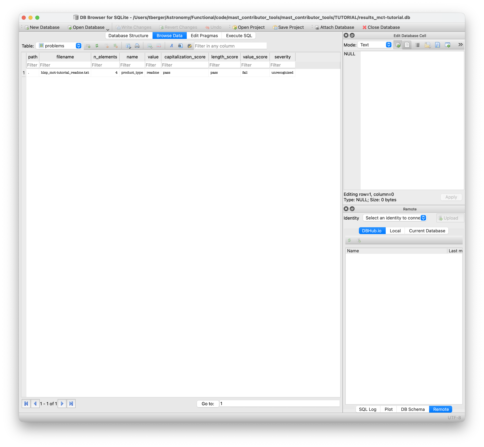

# Reading the File Name Checker Results: Tutorial for SQLite files
This tutorial will provide a brief overview for how to open and use SQLite files, which will be produced upon running the filename checker on your fileset. Please refer to the [`Filename Check README`](../docs/filename_check_readme.md) for additional information about running the filename checker. If this is the first time you've used the Filename Checking software, you may want to run through the [`TUTORIAL README`](../TUTORIAL/tutorial_readme.md) first to familiarize yourself with the process and the SQLite files the software produces.

## Reading and Interacting with SQLite files
Assuming you've run through the tutorial and completed [**STEP 4b**](../TUTORIAL/tutorial_readme.md#step-4b:-check-all-file-names-in-a-directory), you should have a `results_mct-tutorial.db` file in the [`TUTORIAL/`](../TUTORIAL/) folder now. You can interact with this file in any way you prefer, but we suggest you:

### View with the [DB Browser for SQLite](https://sqlitebrowser.org/)
Once you've downloaded and installed the DB Browser, open it and select `Open Database` and then navigate to the folder in which your results database resides. Select and open the corresponding DB file. Your window should look something like what is shown in Figure 1:


Similar to Figure 1, you should now be seeing the `Database Structure` tab highlighted, with a few tables populating the left panel. Those tables are `fields` and `filename`. If you click on the arrows next to the two table names, you should see the names of the columns that belong to each table. There is also a `Views` heading where you can find the `problems` view, which highlights all potential problem fields within the `fields` table.

If you now click on the `Browse Data` tab next to the `Database Structure` tab, you'll be able to view the table itself, which should have the `fields` table selected near the top left hand corner of the window displayed in Figure 2:


The `fields` table contains the results of the filename check for every single field within each filename analyzed. For instance, if you checked 5 filenames with 9 fields each, the `fields` table should have 5*9 = 45 rows. Meanwhile, the `filename` table (which you can access by clicking on the Table box below the tabs and to the left), contains one row per file, indicating the verdict of the filename check on that filename. Finally, the `potential_problems` table lists all potential problems indicated in the `fields` table.

Within the `fields` table, your files are evaluated as follows (see [File Naming Convention](https://outerspace.stsci.edu/display/MASTDOCS/File+Naming+Convention) for more details):

- Capitalization: the filename must be all lower case.
- Character Length: each field has a maximum character length.
- Format: checks overall format and special characters: for example, a period `.` is allowed in the `<version>` field but not in the `<proj-id>`. Certain fields allow hyphen-separated elements. Most fields must begin and end with an ASCII alpha-numeric character.
- Value: In some cases, the contents of each field are validated against known values to the extent possible.

The evaluation scores for individual fields and the overall filenames are one of `PASS`, `NEEDS REVIEW` or `FAIL`. A verdict of `FAIL` means that filename or individual field does not follow our filenaming convention (it breaks one of the above rules) and it must be changed before it will be accepted by MAST. Please review which field(s) have been scored as `FAIL` and update them to match the Capitalization, Character Length, Format, and/or Value rules. A verdict of `NEEDS REVIEW` is usually the result of an unrecognized value. This is often necessary and correct, e.g. for new product types or instruments whose data we haven't ingested before. Please consult with MAST staff (mast_contrib@stsci.edu) for review.

Within the `filename` table (`Browse Data` tab, then select table `filename` in the top left box), each filename is listed with the overall status (automatically set to the most critical of `PASS`, `NEEDS REVIEW` or `FAIL`) as well as the number of elements identified in the filename. An example is shown below in Figure 3:



Finally, there's the `problems` table. You can access this table using the same dropdown menu in the top left corner of the window. This table contains all filenames that could have problems, from those that need review to those that fail. An example of this table is shown in Figure 4 below. You may have to modify the window size/click and drag the window dividers to view all columns within the Browser:



Again, please see [`filename_check_readme.md`](../docs/filename_check_readme.md) for how to run the filechecker or the HLSP [File Naming Convention](https://outerspace.stsci.edu/display/MASTDOCS/File+Naming+Convention) for detailed rules.

### Opening the SQLite file with Python

An alternative way to read and interact with the DB file is to open it in Python. This might be useful for large HLSPs with many files, or if you want to explore the results programmatically.

For instance, if you want to get the full list of tables and views available to query, you can use the following Python code:

```python
# load sqlite3 and pandas module
import sqlite3
import pandas as pd

# modify the path to reflect the relative path of your results_mct-tutorial.db file
dbfile = '/relative/path/to/results_mct-tutorial.db'

# Open the file using sqlite3
conn = sqlite3.connect(dbfile)

# Convert the various tables into pandas dataframes:
file_evaluations = pd.read_sql_query("SELECT * FROM filename", conn)
field_evaluations = pd.read_sql_query("SELECT * FROM fields", conn)
problems = pd.read_sql_query("SELECT * FROM problems", conn)

# Print to see what the results look like:
print(file_evaluations)
```

|    | path   | filename                                                      | status   |   n_elements |
|---:|:-------|:--------------------------------------------------------------|:---------|-------------:|
|  0 | .      | hlsp_mct-tutorial_jwst_nirspec_galaxy3_multi_v1_spec.fits     | pass     |            9 |
|  1 | .      | hlsp_mct-tutorial_jwst_nirspec_all-galaxies_multi_v1_cat.fits | pass     |            9 |
|  2 | .      | hlsp_mct-tutorial_jwst_nirspec_galaxy1_multi_v1_spec.fits     | pass     |            9 |
|  3 | .      | hlsp_mct-tutorial_jwst_nirspec_galaxy2_multi_v1_spec.fits     | pass     |            9 |
|  4 | .      | hlsp_mct-tutorial_readme.txt                                  | pass     |            4 |

```python
print(field_evaluations)
```

|    | file_ref                                                      | name         | value        | capitalization_score   | length_score   | value_score   | severity     |
|---:|:--------------------------------------------------------------|:-------------|:-------------|:-----------------------|:---------------|:--------------|:-------------|
|  0 | hlsp_mct-tutorial_jwst_nirspec_galaxy3_multi_v1_spec.fits     | hlsp_str     | hlsp         | pass                   | pass           | pass          | N/A          |
|  1 | hlsp_mct-tutorial_jwst_nirspec_galaxy3_multi_v1_spec.fits     | hlsp_name    | mct-tutorial | pass                   | pass           | pass          | N/A          |
|  2 | hlsp_mct-tutorial_jwst_nirspec_galaxy3_multi_v1_spec.fits     | extension    | fits         | pass                   | pass           | pass          | N/A          |
|  3 | hlsp_mct-tutorial_jwst_nirspec_galaxy3_multi_v1_spec.fits     | product_type | spec         | pass                   | pass           | pass          | N/A          |
|  4 | hlsp_mct-tutorial_jwst_nirspec_galaxy3_multi_v1_spec.fits     | version_id   | v1           | pass                   | pass           | pass          | N/A          |
|  5 | hlsp_mct-tutorial_jwst_nirspec_galaxy3_multi_v1_spec.fits     | mission      | jwst         | pass                   | pass           | pass          | N/A          |
|  6 | hlsp_mct-tutorial_jwst_nirspec_galaxy3_multi_v1_spec.fits     | instrument   | nirspec      | pass                   | pass           | pass          | N/A          |
|  7 | hlsp_mct-tutorial_jwst_nirspec_galaxy3_multi_v1_spec.fits     | target_name  | galaxy3      | pass                   | pass           | pass          | N/A          |
|  8 | hlsp_mct-tutorial_jwst_nirspec_galaxy3_multi_v1_spec.fits     | filter       | multi        | pass                   | pass           | pass          | N/A          |
|  9 | hlsp_mct-tutorial_jwst_nirspec_all-galaxies_multi_v1_cat.fits | hlsp_str     | hlsp         | pass                   | pass           | pass          | N/A          |
| 10 | hlsp_mct-tutorial_jwst_nirspec_all-galaxies_multi_v1_cat.fits | hlsp_name    | mct-tutorial | pass                   | pass           | pass          | N/A          |
| 11 | hlsp_mct-tutorial_jwst_nirspec_all-galaxies_multi_v1_cat.fits | extension    | fits         | pass                   | pass           | pass          | N/A          |
| 12 | hlsp_mct-tutorial_jwst_nirspec_all-galaxies_multi_v1_cat.fits | product_type | cat          | pass                   | pass           | pass          | N/A          |
| 13 | hlsp_mct-tutorial_jwst_nirspec_all-galaxies_multi_v1_cat.fits | version_id   | v1           | pass                   | pass           | pass          | N/A          |
| 14 | hlsp_mct-tutorial_jwst_nirspec_all-galaxies_multi_v1_cat.fits | mission      | jwst         | pass                   | pass           | pass          | N/A          |
| 15 | hlsp_mct-tutorial_jwst_nirspec_all-galaxies_multi_v1_cat.fits | instrument   | nirspec      | pass                   | pass           | pass          | N/A          |
| 16 | hlsp_mct-tutorial_jwst_nirspec_all-galaxies_multi_v1_cat.fits | target_name  | all-galaxies | pass                   | pass           | pass          | N/A          |
| 17 | hlsp_mct-tutorial_jwst_nirspec_all-galaxies_multi_v1_cat.fits | filter       | multi        | pass                   | pass           | pass          | N/A          |
| 18 | hlsp_mct-tutorial_jwst_nirspec_galaxy1_multi_v1_spec.fits     | hlsp_str     | hlsp         | pass                   | pass           | pass          | N/A          |
| 19 | hlsp_mct-tutorial_jwst_nirspec_galaxy1_multi_v1_spec.fits     | hlsp_name    | mct-tutorial | pass                   | pass           | pass          | N/A          |
| 20 | hlsp_mct-tutorial_jwst_nirspec_galaxy1_multi_v1_spec.fits     | extension    | fits         | pass                   | pass           | pass          | N/A          |
| 21 | hlsp_mct-tutorial_jwst_nirspec_galaxy1_multi_v1_spec.fits     | product_type | spec         | pass                   | pass           | pass          | N/A          |
| 22 | hlsp_mct-tutorial_jwst_nirspec_galaxy1_multi_v1_spec.fits     | version_id   | v1           | pass                   | pass           | pass          | N/A          |
| 23 | hlsp_mct-tutorial_jwst_nirspec_galaxy1_multi_v1_spec.fits     | mission      | jwst         | pass                   | pass           | pass          | N/A          |
| 24 | hlsp_mct-tutorial_jwst_nirspec_galaxy1_multi_v1_spec.fits     | instrument   | nirspec      | pass                   | pass           | pass          | N/A          |
| 25 | hlsp_mct-tutorial_jwst_nirspec_galaxy1_multi_v1_spec.fits     | target_name  | galaxy1      | pass                   | pass           | pass          | N/A          |
| 26 | hlsp_mct-tutorial_jwst_nirspec_galaxy1_multi_v1_spec.fits     | filter       | multi        | pass                   | pass           | pass          | N/A          |
| 27 | hlsp_mct-tutorial_jwst_nirspec_galaxy2_multi_v1_spec.fits     | hlsp_str     | hlsp         | pass                   | pass           | pass          | N/A          |
| 28 | hlsp_mct-tutorial_jwst_nirspec_galaxy2_multi_v1_spec.fits     | hlsp_name    | mct-tutorial | pass                   | pass           | pass          | N/A          |
| 29 | hlsp_mct-tutorial_jwst_nirspec_galaxy2_multi_v1_spec.fits     | extension    | fits         | pass                   | pass           | pass          | N/A          |
| 30 | hlsp_mct-tutorial_jwst_nirspec_galaxy2_multi_v1_spec.fits     | product_type | spec         | pass                   | pass           | pass          | N/A          |
| 31 | hlsp_mct-tutorial_jwst_nirspec_galaxy2_multi_v1_spec.fits     | version_id   | v1           | pass                   | pass           | pass          | N/A          |
| 32 | hlsp_mct-tutorial_jwst_nirspec_galaxy2_multi_v1_spec.fits     | mission      | jwst         | pass                   | pass           | pass          | N/A          |
| 33 | hlsp_mct-tutorial_jwst_nirspec_galaxy2_multi_v1_spec.fits     | instrument   | nirspec      | pass                   | pass           | pass          | N/A          |
| 34 | hlsp_mct-tutorial_jwst_nirspec_galaxy2_multi_v1_spec.fits     | target_name  | galaxy2      | pass                   | pass           | pass          | N/A          |
| 35 | hlsp_mct-tutorial_jwst_nirspec_galaxy2_multi_v1_spec.fits     | filter       | multi        | pass                   | pass           | pass          | N/A          |
| 36 | hlsp_mct-tutorial_readme.txt                                  | hlsp_str     | hlsp         | pass                   | pass           | pass          | N/A          |
| 37 | hlsp_mct-tutorial_readme.txt                                  | hlsp_name    | mct-tutorial | pass                   | pass           | pass          | N/A          |
| 38 | hlsp_mct-tutorial_readme.txt                                  | extension    | txt          | pass                   | pass           | pass          | N/A          |
| 39 | hlsp_mct-tutorial_readme.txt                                  | product_type | readme       | pass                   | pass           | fail          | unrecognized |

```python
print(problems)
```

|    | path   | filename                     |   n_elements | name         | value   | capitalization_score   | length_score   | value_score   | severity     |
|---:|:-------|:-----------------------------|-------------:|:-------------|:--------|:-----------------------|:---------------|:--------------|:-------------|
|  0 | .      | hlsp_mct-tutorial_readme.txt |            4 | product_type | readme  | pass                   | pass           | fail          | unrecognized |

```python
# Close connection:
conn.close()
```

The tables should appear exactly the same as those in the screenshots above, and you can use pandas functions and filtering to find and analyze the results. As always, if you have any questions, please don't hesitate to reach out to mast_contrib@stsci.edu.
